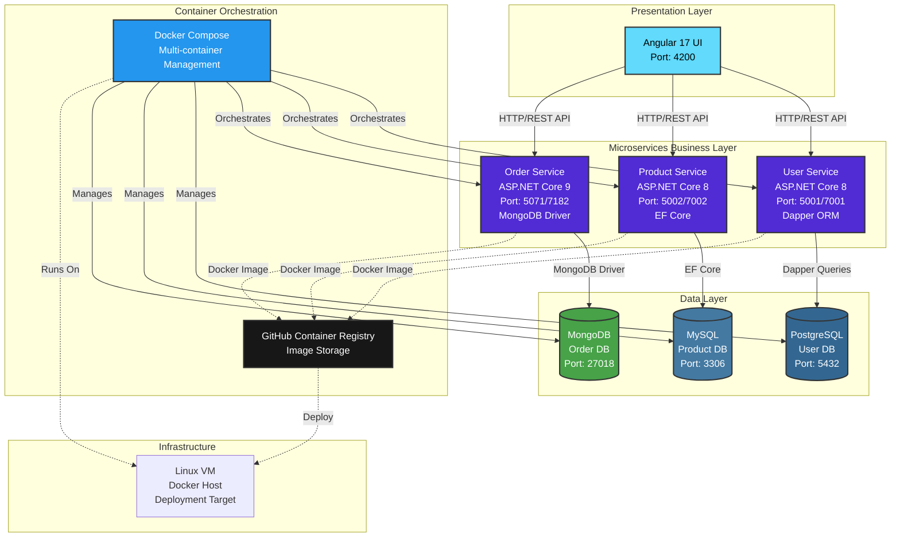

# eCommerce - Web Application (ASP .NET Core Microservices with Azure DevOps & AKS)

- [eCommerce - Web Application (ASP .NET Core Microservices with Azure DevOps \& AKS)](#ecommerce---web-application-asp-net-core-microservices-with-azure-devops--aks)
  - [Background](#background)
  - [Architecture Overview](#architecture-overview)
    - [Microservices Architecture](#microservices-architecture)
    - [Service Communication](#service-communication)
    - [Deployment Strategy](#deployment-strategy)
  - [Technologies \& Patterns Used](#technologies--patterns-used)

## Background

- Build comprehensive eCommerce application with ASP .NET Core microservices in .net 8
- Real-world experience in microservices development
- Complete eCommerce Project: Build a fully functional eCommerce platform featuring users, products, and orders microservices.

## Architecture Overview

> **Note**: OrderService uses HTTP clients to call other services. Default container targets (from Dockerfile envs): ProductService at port 5247, UserService at port 9090.

### Microservices Architecture

Each microservice follows a **clean architecture** pattern with three layers:

1. **API Layer** (`*.API` project)
   - RESTful endpoints
   - Middleware (Exception Handling, CORS)
   - Swagger documentation
   - Minimal API / Controllers

2. **Business Logic Layer** (`*.BusinessLogicLayer` / `*.Core` project)
   - Service contracts and implementations
   - DTOs (Data Transfer Objects)
   - Object mapping (Mapster)
   - FluentValidation validators
   - Business rules

3. **Data Access Layer** (`*.DataAccessLayer` / `*.Infrastructure` project)
   - Repository pattern
   - Database context
   - Entity models
   - Data access logic

### Service Communication

- **User Service**: Manages user authentication, registration, and profiles
- **Product Service**: Handles product catalog, inventory management
- **Order Service**: Processes orders, order items, and order history

Each service:

- Exposes REST APIs
- Maintains its own database (Database per Service pattern)
- Can be deployed independently
- Runs in isolated Docker containers

### Deployment Strategy

1. **Development**: Local development with docker-compose
2. **CI/CD**: GitHub Actions → GitHub Container Registry
3. **Production**: Linux VM with Docker Compose orchestration
4. **Future**: Azure Kubernetes Service (AKS) deployment

## Technologies & Patterns Used

- ASP.NET Core 8 (Web API in c#)
- Microservices Architecture
- REST API (HTTP Methods - GET, POST, PUT, DELETE)
- Mapster (Object to Object Mapping), earlier used AutoMapper
- Repository Pattern
- Dapper (Micro ORM for data access)
- PostgreSQL (Relational Database) in docker container
- FluentValidation (Request validation)
- Dependency Injection (DI) Pattern
- Swagger (API Documentation)
- CORS Policy Configuration
- Angular 17 (Frontend application)
- MySQL (Relational Database) in docker container
- Docker (Containerization)
- Docker Compose (Multi-container orchestration)
- Deployment to Dockerized environment on Linux VM box
- MongoDb (NoSQL Database) in docker container
- Fault Tolerance and Resilience (Polly - Future Implementation: Retry, Circuit Breaker, Fallback, Bulkhead Isolation, Timeout)
- Logging and Monitoring (ILogger - Future Implementation)
