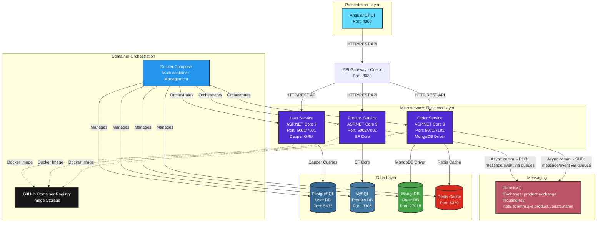
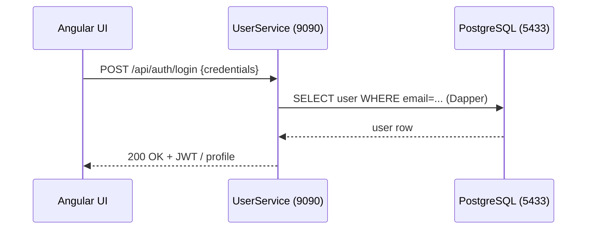
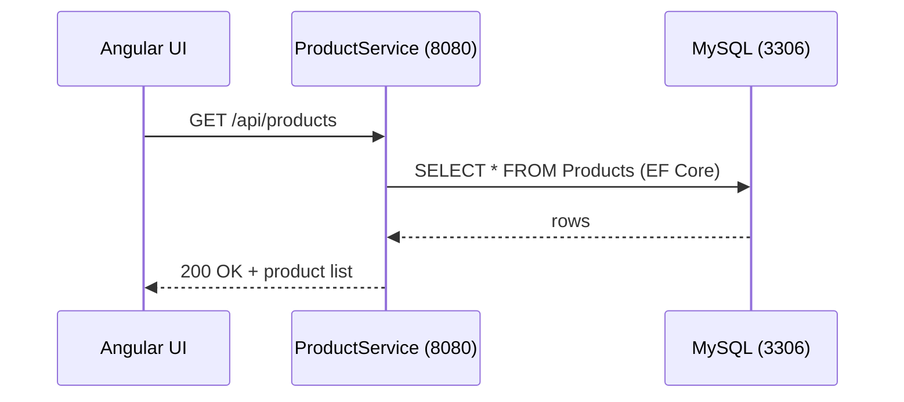
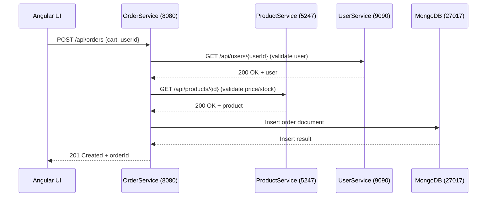
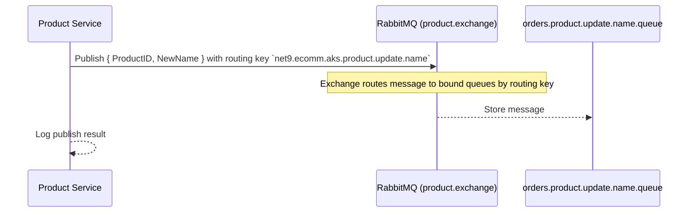
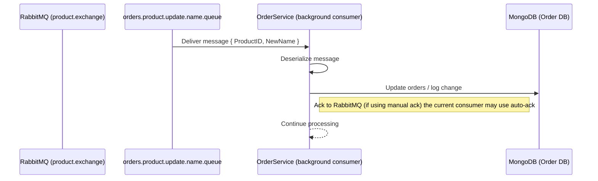

# Architecture

This document expands the architecture diagram in the main README and provides per-service sequence diagrams showing typical call flows and database interactions.

## **High-level overview**



## **Cache (Redis)**

- **Role:** Distributed in-memory cache for frequently read data (product/catalog lookups), session state, and short-lived data to reduce DB load and lower request latency.
- **Placement:** A shared cache instance used by all services (User, Product, Order). In cloud deployments prefer a managed service such as **Azure Cache for Redis**.
- **Common usage patterns:**  
  - **Read-through / Write-through cache:** Cache product details, pricing snapshots, and computed DTOs.
  - **Session cache:** Store minimal session data or JWT blacklists (avoid storing PII).
  - **Distributed locks / counters:** Use Redis primitives (SETNX, INCR) with care.
  - **Pub/Sub:** Optionally use Redis Pub/Sub for lightweight invalidation or cache-churn signals (RabbitMQ remains primary event bus).
- **Configuration (env vars):** `REDIS_HOST`, `REDIS_PORT` (default `6379`), `REDIS_PASSWORD` (when enabled), `REDIS_SSL=true|false`.
- **.NET example (StackExchange.Redis):**

```csharp
var conn = ConnectionMultiplexer.Connect($"{env:REDIS_HOST}:{env:REDIS_PORT},password={env:REDIS_PASSWORD}");
var db = conn.GetDatabase();
await db.StringSetAsync("product:123", json, TimeSpan.FromMinutes(10));
var cached = await db.StringGetAsync("product:123");
```

- **Resilience & best practices:**
  - Set sensible TTLs (e.g., 5–60 minutes) depending on staleness tolerance.
  - Design for cache misses — always fall back to the authoritative DB and repopulate the cache.
  - Use connection pooling and a singleton `ConnectionMultiplexer` per process.
  - Monitor cache hit rate and eviction metrics; provision memory and enable persistence or replication per SLAs.
  - For production on Azure, enable clustering or premium tiers for replication and better throughput.

> Dev tip: run Redis locally via Docker (`docker run -p 6379:6379 redis:7`) for local dev and integration tests.
> **Note**: OrderService uses HTTP clients to call other services. Default container targets (from Dockerfile envs): ProductService at port 5247, UserService at port 9090.

## **Service details and environment notes**

- User Service
  - Container env defaults (from Dockerfile): `POSTGRESDB_HOST=localhost`, `POSTGRESDB_PORT=5433` (DB: PostgreSQL)
  - Exposed container ports: `9090`, `9091` (Kestrel endpoint configured at `http://0.0.0.0:9090/`)

- Product Service
  - Container env defaults (from Dockerfile): `MYSQL_HOST=localhost`, `MYSQL_PORT=3306`, `MYSQL_DATABASE=eCommerceProducts`
  - Exposed container ports: `8080`, `8081`

- Order Service
  - Container env defaults (from Dockerfile): `MONGODB_HOST=localhost`, `MONGODB_PORT=27017`
  - Also configured to call other services using env keys: `UserServiceName`, `UserServicePort`, `ProductServiceName`, `ProductServicePort` (defaults point to `localhost:9090` and `localhost:5247` respectively)
  - Exposed container ports: `8080`, `8081`

## **UI Component**

- **Framework**: Angular 17 (project at `eCommerce.UI`).
- **Responsibilities**: client-side application — routing, product catalog, cart management, authentication UI, and calling backend APIs through the API Gateway (Ocelot).
- **Key paths**: `eCommerce.UI/src` contains app code; `eCommerce.UI/package.json` contains dev scripts.
- **Local dev**: run from repo root in the `eCommerce.UI` folder:

```bash
cd eCommerce.UI
npm install
npm run start    # starts Angular dev server (default port 4200)
```

- **Production build**:

```bash
cd eCommerce.UI
npm run build    # outputs production assets in dist/
```

- **Container**: application can be containerized and served by a static web server or via the same Docker Compose setup used for services; map the container port `4200` (or serve built `dist/` from Nginx).

- **Integration**: UI calls the API Gateway at `http://<gateway-host>:8080` (configured in `eCommerce.UI/src/app/app.config.ts` or environment files). When running locally with Docker Compose the gateway proxies to service container ports.

## **Per-service sequence diagrams**

### **User Service — typical auth flow**



### **Product Service — product fetch flow**



### **Order Service — place order flow**



### **ProductService — publish product update event**



### **OrderService — consume product update event**



Notes

- Sequence diagrams show typical synchronous JSON HTTP calls between services. The solution now uses RabbitMQ for async product events:
  - `ProductService` publishes product events to the `product.exchange` exchange (routing key `net9.ecomm.aks.product.update.name`).
  - `OrderService` runs a background consumer (hosted service) that subscribes to the queue bound to that exchange and applies updates (consumer implemented as `ProductNameUpdateConsumer`).
  - You can run RabbitMQ locally using the included Docker Compose service (image `rabbitmq:management`).
- Container ports shown are the exposed container ports. When using `docker-compose` you may map these to different host ports — diagram shows container-level values found in each service's Dockerfile and Kestrel config.

How to preview

- In VS Code: open the file and press `Ctrl+Shift+V` (or `Command+Shift+V` on macOS) to open the Markdown preview which renders Mermaid diagrams if you have a Mermaid preview extension installed.
- Alternatively, push to GitHub and view the Markdown on the repo (GitHub will render Mermaid diagrams in the web UI if enabled for the repo).

Example git commands to commit this doc (optional)

```bash
git add docs/architecture.md ReadMe.md
git commit -m "docs: add architecture.md with expanded diagrams and per-service flows"
git push origin main
```
