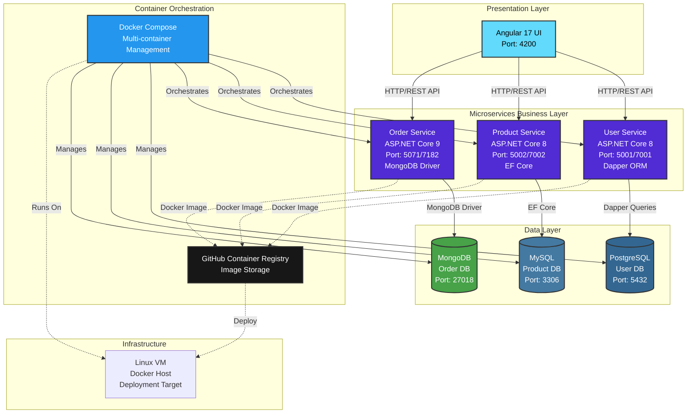
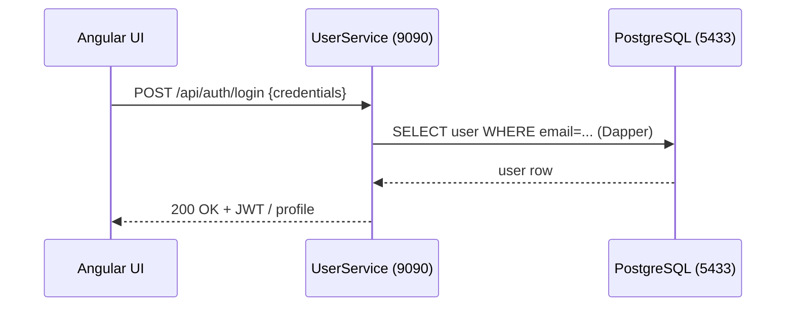
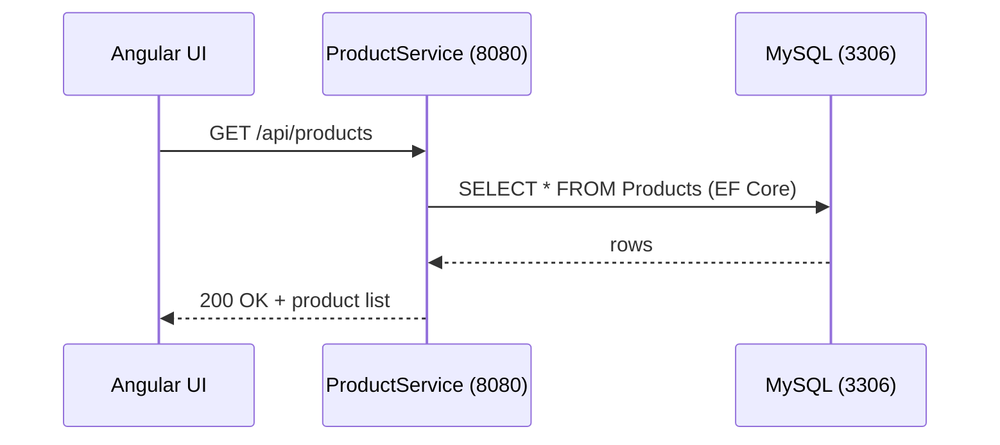
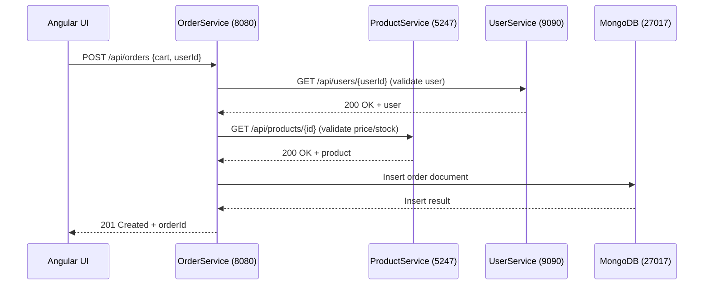

# Architecture

This document expands the architecture diagram in the main README and provides per-service sequence diagrams showing typical call flows and database interactions.

## **High-level overview**



> **Note**: OrderService uses HTTP clients to call other services. Default container targets (from Dockerfile envs): ProductService at port 5247, UserService at port 9090.

## **Service details and environment notes**

- User Service
  - Container env defaults (from Dockerfile): `POSTGRESDB_HOST=localhost`, `POSTGRESDB_PORT=5433` (DB: PostgreSQL)
  - Exposed container ports: `9090`, `9091` (Kestrel endpoint configured at `http://0.0.0.0:9090/`)

- Product Service
  - Container env defaults (from Dockerfile): `MYSQL_HOST=localhost`, `MYSQL_PORT=3306`, `MYSQL_DATABASE=eCommerceProducts`
  - Exposed container ports: `8080`, `8081`

- Order Service
  - Container env defaults (from Dockerfile): `MONGODB_HOST=localhost`, `MONGODB_PORT=27017`
  - Also configured to call other services using env keys: `UserServiceName`, `UserServicePort`, `ProductServiceName`, `ProductServicePort` (defaults point to `localhost:9090` and `localhost:5247` respectively)
  - Exposed container ports: `8080`, `8081`

## **Per-service sequence diagrams**

### **User Service — typical auth flow**



### **Product Service — product fetch flow**



### **Order Service — place order flow**



Notes

- Sequence diagrams show typical synchronous JSON HTTP calls between services. In production you might replace some flows with asynchronous messaging (e.g., event bus) to improve resilience and scalability.
- Container ports shown are the exposed container ports. When using `docker-compose` you may map these to different host ports — diagram shows container-level values found in each service's Dockerfile and Kestrel config.

How to preview

- In VS Code: open the file and press `Ctrl+Shift+V` (or `Command+Shift+V` on macOS) to open the Markdown preview which renders Mermaid diagrams if you have a Mermaid preview extension installed.
- Alternatively, push to GitHub and view the Markdown on the repo (GitHub will render Mermaid diagrams in the web UI if enabled for the repo).

Example git commands to commit this doc (optional)

```bash
git add docs/architecture.md ReadMe.md
git commit -m "docs: add architecture.md with expanded diagrams and per-service flows"
git push origin main
```
